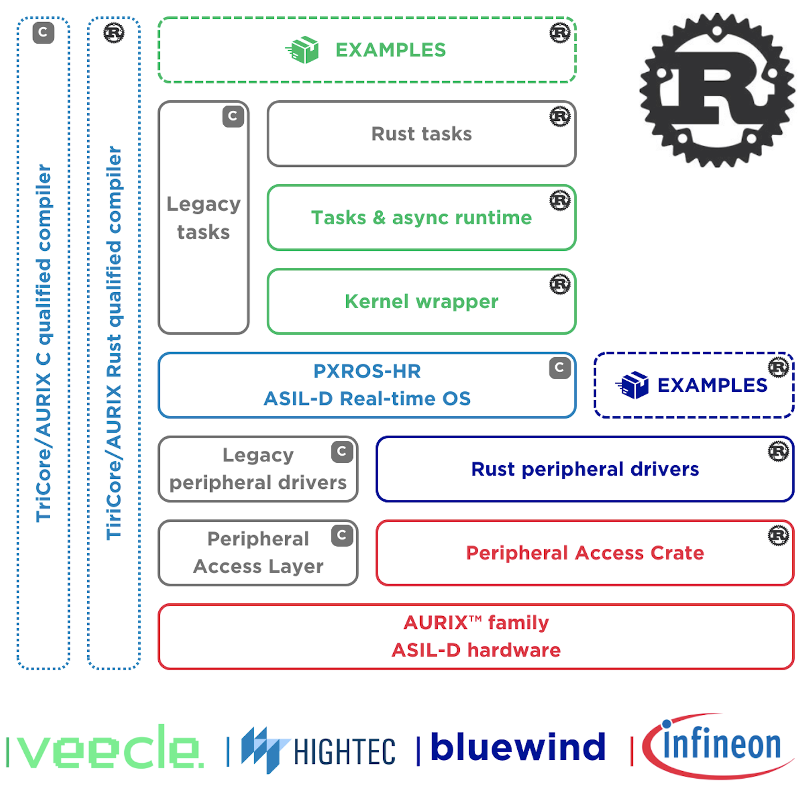

# Veecle-pxros

A runtime for writing automotive and industrial Rust on top of HighTec's safety kernel for the Infineon AURIX™ Platform.

* **Usability**: The code, examples, and tooling have been designed to minimize friction and allow for a productive developer experience from the get-go.
* **Future-proof**: Integration with a safety kernel and isolation into memory-protected tasks ensures Rust can be used in critical contexts.
* **Legacy Compatible**: By isolating Rust into tasks, we facilitate the coexistence of legacy C tasks with Rust. This enables the reuse of proven code and avoiding costly re-implementations while innovating with Rust.

> [!WARNING]
> This project is in its early stages and may not work as intended, especially on Linux. Feedback, suggestions, or contributions are welcome!

# About Veecle

This repository is part of the **Veecle Development Framework**, serving as the backbone for deploying **Veecle NOS** in critical contexts. Veecle NOS is a cutting-edge, data-driven asynchronous runtime designed specifically for automotive development, written entirely in the Rust programming language.

NOS empowers carmakers to deliver an experience akin to that of using a smartphone, enabling the rapid development and deployment of digital features directly into existing vehicle systems. NOS layered abstraction model simplifies interaction with vehicle data, enhancing system flexibility.

NOS facilitates and simplifies communication between vehicle components, promoting continuous evolution and improvement of vehicle functionalities. This approach streamlines the development and shortens innovation cycles, allowing for the addition of features in a mid-cycle vehicle update.

## Get in touch

For licensing, demonstrations, or to learn more about **Veecle's Development Framework**, please reach out to us at [sales@veecle.io](mailto:sales@veecle.io) or visit our website at [veecle.io](https://www.veecle.io).

# AURIX™ Rust Startup Ecosystem

The AURIX™ Rust Startup Ecosystem is a collaborative effort involving [Veecle](https://www.veecle.io), [Infineon](https://www.infineon.com), [HighTec](https://hightec-rt.com) and [Bluewind](https://www.bluewind.it) aimed at supporting Rust on Infineon's AURIX™ architecture for automotive and industrial applications. The primary objective is to empower customers to seamlessly integrate Rust tasks alongside existing C implementations for evaluation and pre-development purposes.

<p align="center">
  
</p>

The AURIX™ Rust Startup Ecosystem consists of:
* A [Peripheral Access Crate](https://github.com/Infineon/tc375-pac) (PAC) from Infineon.
* [Low-level drivers](https://github.com/bluewind-embedded-systems/bw-r-drivers-tc37x) from Bluewind, fully written in Rust.
* A precompiled version of [PXROS-HR](https://hightec-rt.com/en/products/real-time-os), an ASIL-D RTOS written in C, developed by HighTec.
* Rust [PXROS-HR bindings](https://github.com/hightec-rt/pxros) developed jointly by Veecle and HighTec.
* A Rust runtime from Veecle, named [veecle-pxros](https://github.com/veecle/veecle-pxros), which seamlessly integrates with PXROS-HR, providing a native Rust experience. This runtime also supports asynchronous execution where feasible.
* A curated set of examples by Veecle and Bluewind, covering bare metal driver examples, driver instances employing PXROS-HR, and connectivity application demonstrations.

For compiling Rust for AURIX™, HighTec offers a combined package of their Rust and C/C++ compiler, accessible [here](https://hightec-rt.com/en/products/development-platform).

Finally, to facilitate flashing and debugging on AURIX Veecle is maintaining the [tricore-probe](https://github.com/veecle/tricore-probe).

For additional information visit:
* https://www.veecle.io/aurix
* https://www.bluewind.it/rust
* https://hightec-rt.com/rust

# Getting started

> [!NOTE]  
> The included BSP only supports the [TC375 Lite Kit](https://www.infineon.com/cms/en/product/evaluation-boards/kit_a2g_tc375_lite/). Please open an issue or contact us if you require support for a different board.

The Rust code is structured to work with the [defmt](https://github.com/knurling-rs/defmt) framework and [tricore-probe](https://github.com/veecle/tricore-probe).

The compilation process works by first compiling a Rust library, defining one or more PXROS tasks, via **Cargo**. For Rust library examples, please see the **/examples** folder.

Next, **CMake** is used to compile the PXROS kernel and C tasks defined in the **app-tc37x** folder and to link everything together with the Rust library. The output is a `.elf` file that can be flashed to a board via Debugger or MEMTOOL.

## Installation

1. Install [rustup](https://rustup.rs) and this [toolchain](./rust-toolchain.toml): this is needed by Rust Analyzer to compile and test tricore-agnostic code and by HighTec's installer to configure the default toolchain.

2. Install HighTec's [Rust](https://hightec-rt.com/en/rust-evaluation) compiler toolchain. Register and follow their installation instruction.

3. If on Windows, install Infineon's [DAS](https://www.infineon.com/cms/en/tools/aurix-tools/free-tools/infineon) and [AurixFlasher](https://softwaretools.infineon.com/tools/com.ifx.tb.tool.aurixflashersoftwaretool): these tools are required to utilize [tricore-probe](https://github.com/veecle/tricore-probe).
If you are using Linux, please follow the guidelines provided in the [tricore-probe](https://github.com/veecle/tricore-probe) repository.

4. Install **tricore-probe** via `cargo install tricore-probe --git https://github.com/veecle/tricore-probe --version 0.2.0`.
Make sure the listed requirements are installed.

For additional installation instructions or troubleshooting please also visit [Bluewind's repository](https://github.com/bluewind-embedded-systems/bw-r-drivers-tc37x).

#### Troubleshooting

* Make sure that the environment variable `LIBCLANG_PATH` points to HighTec's toolchain.

## Building and running

This repository provides a utility tool (`xtask`) to facilitate compilation and execution on a connected board or on the TSIM emulator.

#### Compile and run on the hardware board:

```bash
cargo xtask run --binary example-ipc --target tc162
```

#### Compile and run on the `tsim` emulator:

```bash
cargo xtask emulate --binary example-ipc --target tc162
```

#### Build the application without running it:

```bash
cargo xtask build --binary example-ipc --target tc162
```

`xtask` requires `tricore-probe` only when running the binary. If `tricore-probe` is not available in your system, you can still use `xtask` to build or emulate the project. Other tools (like Infineon's MEMTOOL) can then be used to flash and debug the output `.elf`.

`xtask` requires **CMake**, **Make**, and **Tricore-probe** (if used) to be available in the PATH environment variable.

#### Logging

Event 31 (with bit 1 << 31 set) is reserved by the defmt logging system and is not available for use by tasks. **Logging is only supported in tasks, not in interrupt handlers.**

#### TSIM

TSIM only simulates a single core. The examples were developed for multicore hardware and as such may not function as expected when run on the simulator. Similarly, logging might behave differently than on actual hardware.

#### Examples

Rust examples can be found in [examples](./examples). Examples are meant to run on the real hardware board: running them in **TSIM** will lead to unexpected and unintended behavior.

Additional low-level driver examples provided by Bluewind can be found here: https://github.com/bluewind-embedded-systems/bw-r-drivers-tc37x-examples.

## Limitations

The repository goal is to provide a library that users can simply include in their `Cargo.toml` and use to develop either C or Rust tasks without having to clone or download the whole repository.

However, due to linker/setup limitations, this is currently not possible. Users **must** develop both Rust and C tasks on top of this repository. Rust tasks can reside in any crate as shown by the examples, while C tasks must be developed according to PXROS-HR guidelines. An example can be seen [app-tc37x/pxros/tasks/InitTask].

**This limitation will be lifted in future releases.**

# Feature Requests and Bug Reports

We encourage users to submit feature requests and bug reports. Before submitting, please check if a similar request or report already exists in the issues section.

#### Feature Requests

If you have a feature request, follow these steps:

1. Go to the [Issues](https://github.com/your-username/repository/issues) section of the repository.
2. Click on the "New Issue" button.
3. Provide a clear and descriptive title for your feature request. Please start your title with "Feature: ...".
4. Clearly describe the feature you're proposing, your use-case and how the feature would improve/solve your use-case.

#### Bug Reports

If you've encountered a bug, follow these steps:

1. Go to the [Issues](https://github.com/your-username/repository/issues) section of the repository.
2. Click on the "New Issue" button.
3. Provide a clear and descriptive title for your bug report. Please start your title with "Bug: ...".
4. Clearly describe the issue, including steps to reproduce it.
5. Include information about your environment (e.g., operating system, browser, version), if necessary.

Thank you for helping us improve!

# Contributing

We welcome contributions to help improve and grow the project. Please take a moment to review this document to ensure a smooth and collaborative process.

Contributions happens via **pull requests**. To contribute:

- Fork the repository.
- Make your changes and commit them with a clear and concise commit message.
- Before submitting a pull request, make sure your code adheres to our coding standards and guidelines.
    - You can run `cargo xtask check` to run the CI checks locally. Any warnings or errors will cause the CI to fail.

#### Pull Request Process

- Ensure that your pull request addresses a specific issue or proposes a meaningful enhancement.
- Keep your pull request focused; avoid unrelated changes.
- Make sure your changes are well-tested and highlight any breaking changes in the pull request description.
- Provide a clear and detailed description of your pull request.

#### Testing

- Before submitting a pull request, make sure to test your changes thoroughly.
- Include relevant tests that cover your code changes.
- Ensure that all existing tests pass successfully.

## License

Licensed under Apache License, Version 2.0, with the exception of [app-tc37x](./app-tc37x/).
Unless you explicitly state otherwise, any contribution intentionally submitted for inclusion in this project by you, as defined in the Apache License, Version 2.0, shall be licensed under Apache License, Version 2.0, without any additional terms or conditions.

The folder [app-tc37x](./app-tc37x/) is provided by [HighTec EDV-Systeme GmbH](https://hightec-rt.com) and licensed under [BSL-1.0](./app-tc37x/LICENSE-BSL).
